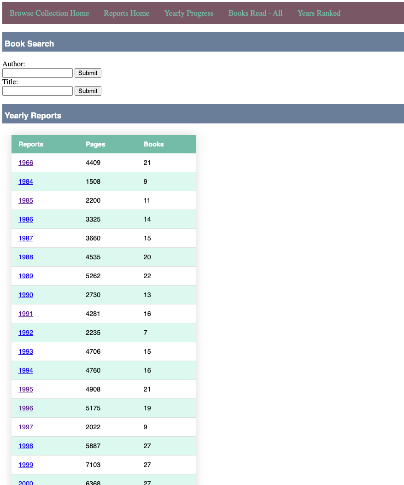

php_books_database
==================

Uses MySQL to manage a simple book database with tagging, last-read, categories and locations.

Change the username, password, database host and database names, then create the tables.

